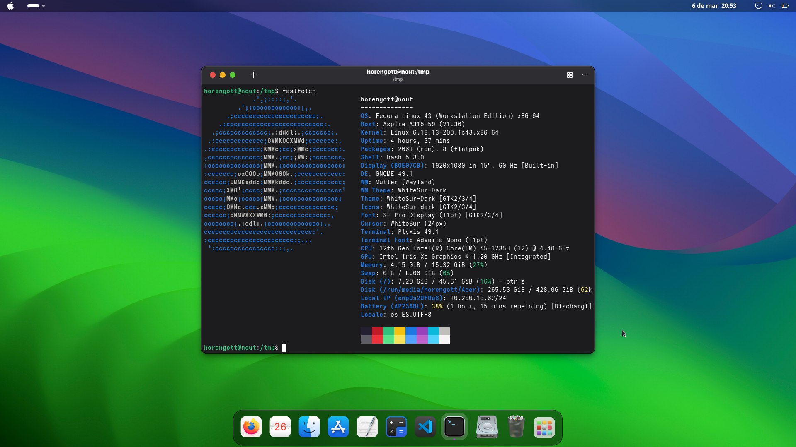

# Fedora macOS Rice: Horengott's Personalized Setup

This is my macOS "rice" (custom desktop setup) for Fedora Linux. Clone my exact setup to get the visual appearance and workflow of a Mac in a matter of minutes.

## Screenshot



**Description:** A Fedora Linux desktop transformed into a macOS clone. It features a gradient wallpaper, a top panel with the global menu bar and centered clock, and a floating bottom Dock with rounded icons. In the center of the screen, the terminal displays `fastfetch` with system details. The window buttons (close, minimize, maximize) are on the left and feature the Mac traffic light design.

## List of Installed Components

The installation script automates the installation and configuration of the following elements:

* **Desktop Environment:** GNOME (Fedora Workstation).
* **Base Theme (GTK Theme):** WhiteSur GTK (Dark theme).
* **Additional Themes:** Firefox Theme (Safari-style), Ulauncher Theme (Spotlight-style).
* **Icon Packs:** WhiteSur icon pack.
* **Cursor Theme:** McMojave cursors.
* **Typography (Fonts):** Official Apple San Francisco Pro fonts (SF Pro).
* **GNOME Extensions:** User Themes (to apply the base theme to the system), Desktop Icons (Ding, for desktop icons), and Compiz alike magic lamp effect (for the macOS genie window minimize animation).
* **Base Programs:** Ulauncher (search engine), GNOME Sushi (Quick Look for file previews).
* **Terminal Utilities:** `fastfetch` (system info), `btop` (resource monitor), `cmatrix`, and `cowsay`.
* **Tools:** Git, Flatpak.
* **Wallpapers:** Complete WhiteSur wallpaper pack.
* **GNOME Configurations:** Automatically positions window buttons to the left and applies the Mac traffic light design.

## Installation Instructions

Follow these steps in your terminal to replicate this setup on any Fedora Linux.

1. **Clone this repository:**
   ```bash
   git clone [https://github.com/horengott/horen-mac-rice.git](https://github.com/horengott/horen-mac-rice.git)